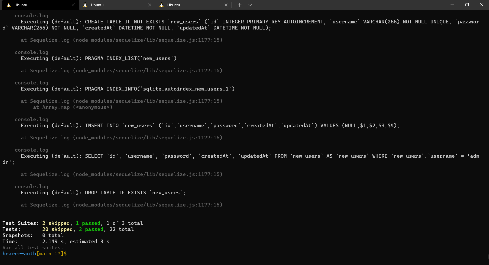
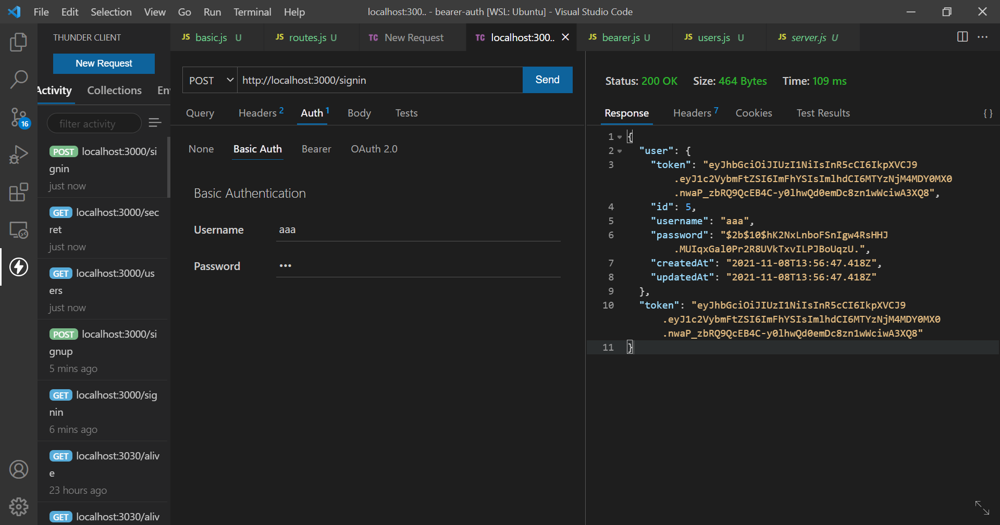
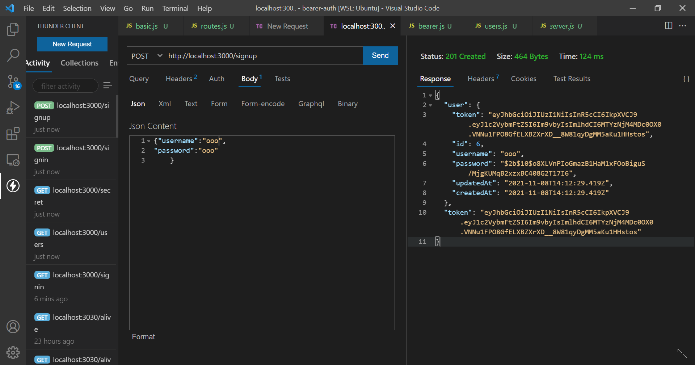
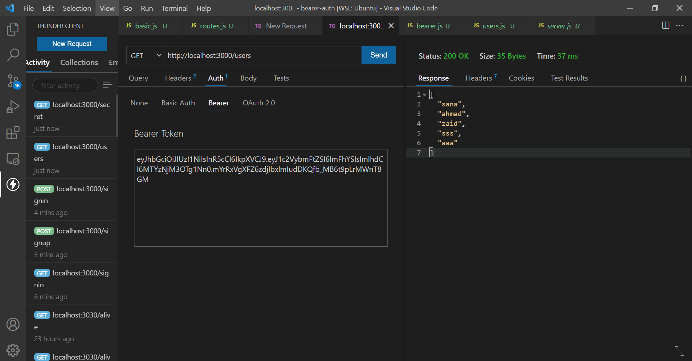
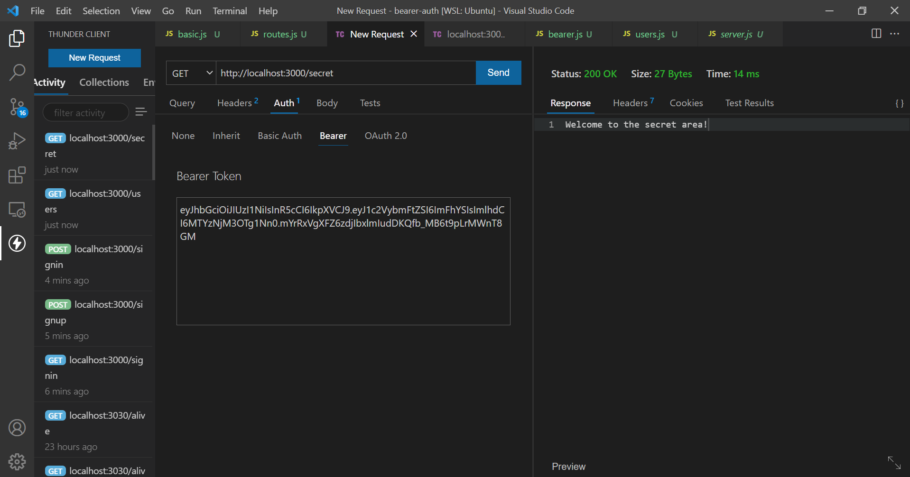

# bearer-auth
## LAB - 07
### Authentication 
Author: Sana Ishaqat

[tests report (actions)](https://github.com/SanaIshaqat/bearer-auth/actions)

[back-end (heroku)](https://sana-bearer-auth-401.herokuapp.com)

[PR Link](https://github.com/SanaIshaqat/bearer-auth/pull/1)

### Setup
.env requirements
PORT - Port Number

### Running the app
npm run dev
Endpoint: /status
Returns Object
{
  "status": "running",
  "port": 3030,
  "domain": "https://sana-bearer-auth-401.herokuapp.com"
}

### Tests
Unit Tests: npm run test

### ThunderClientTests

